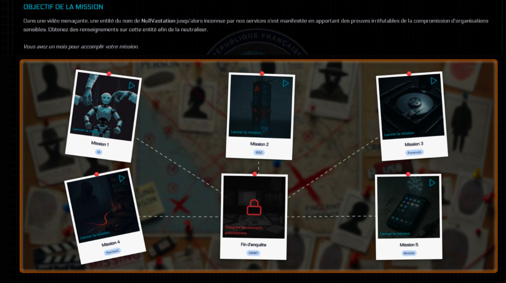
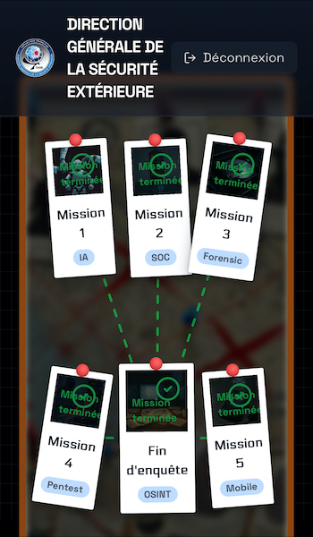

# CTF : Root-Me Pro X DGSE

## Introduction 

Le CTF organisé par Root-Me en partenariat avec la DGSE a été organisé en Avril 2025. Celui-ci comprend 6 défis : 
- Une compromission d'IA 
- Une Analyse de logs 
- Une Mission Forensic
- Un test d'intrusion sur un site web
- Une compromission d'application Android  
- Une recherche OSINT

Le scénario est simple et efficace : un groupe terroriste envoie une vidéo menaçante et commence à installer des ransomware dans des grands groupes français pour déstabiliser la société. Vous devez venir en aide aux force de l'ordre. 

## Resultats

Finalement, après quelques fausses pistes, et quelques difficultés, Tous les challenges sont terminés !

