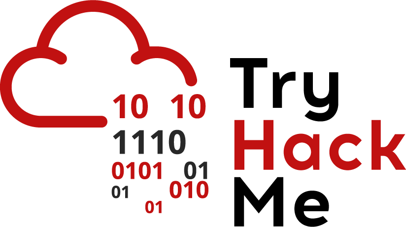

    

# TryHackMe
Cette section comprend tous les writeups que j'ai pu écrire pour des challenges TryHackMe : 

## Quelques Writeups 
* [](./collapsed/hammer) : Compromission via une authentification vulnérable
* [](./collapsed/mrrobot) : Boot to Root sur un wordpress vulnérable
* [](./collapsed/wonderlands) : Énumération et multiples escalades de privilèges
* [](./collapsed/tokyog) : Enumération, Steghanographie, LFI et Obfuscation
* [](./collapsed/rabbitstore) : Parameter Pollution, SSRF, SSTI et RCE
* [](./collapsed/rootme) : Mauvaise gestion des téléchargements et Privesc.

